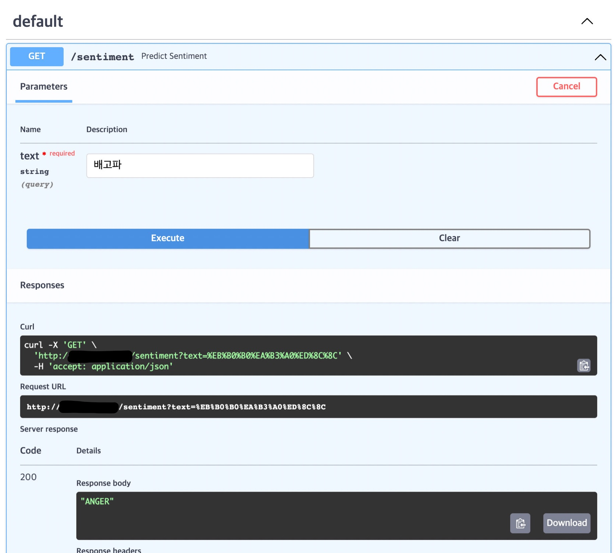
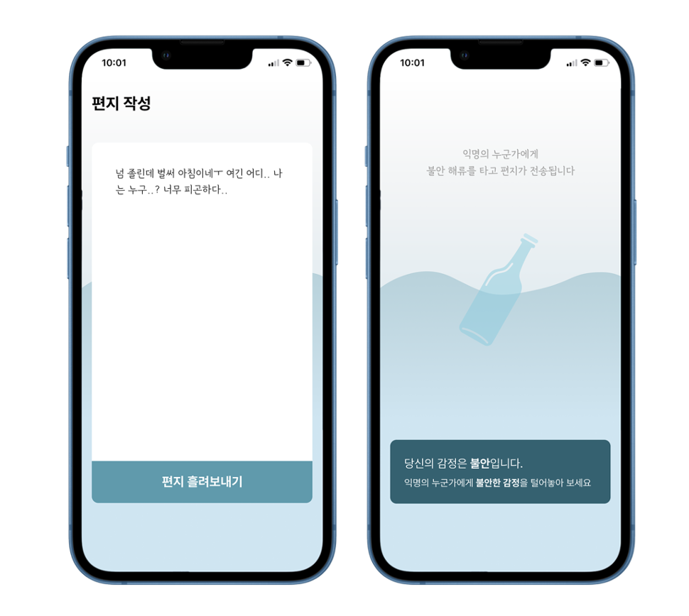
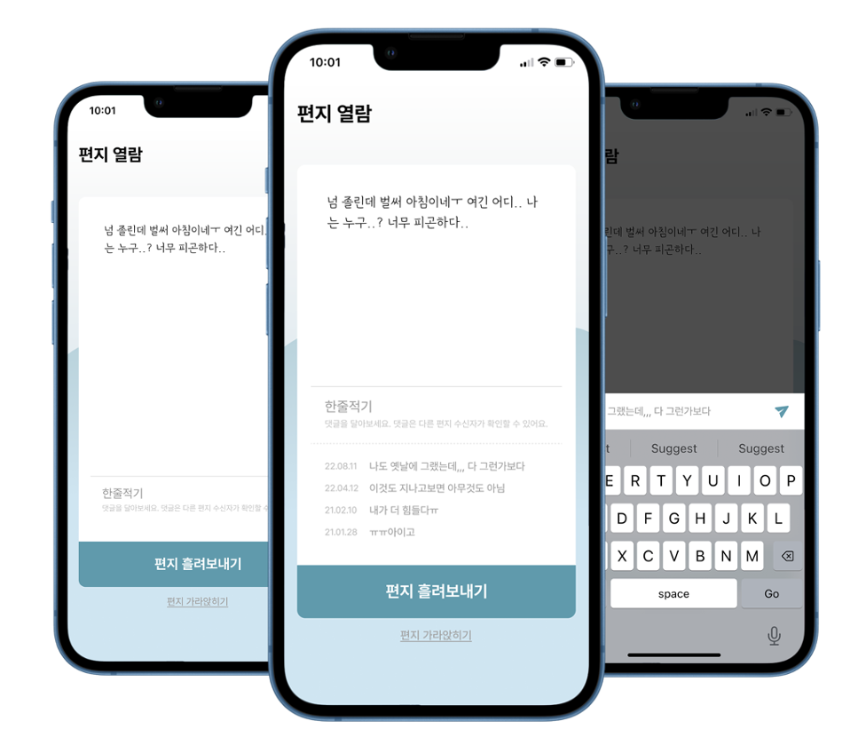

# KU Hackathon Deep Learning Server
<p align="center">
  
</p>

<p align="center">
  
  
</p>

## KU Hackathon
* 2022-08-19 ~ 2022-08-21
* `함께하는 사회`를 주제로 한 2박 3일 간의 hackathon

## 프로젝트 설명
### 개요
[AI HUB 감성 대화 말뭉치](https://aihub.or.kr/aihubdata/data/view.do?currMenu=115&topMenu=100&aihubDataSe=realm&dataSetSn=86) 데이터셋과 [KoBERT](https://github.com/SKTBrain/KoBERT)를 활용해 일상 대화 속 감성 분석을 진행하여 같은 감정을 공유한 사람들끼리 편지를 주고 받을 수 있는 서비스를 구성
### 맡은 역할
* 딥러닝 서버 구축하여 작성한 편지에 대한 감성 분석 결과를 제공

### 데이터 전처리
[데이터셋 전처리 코드](https://github.com/cricky04/KU-Hackathon-DL-Server)

## 개발 후기
- KoBERT 환경설정 하는데 애를 많이 먹었다. 실험환경과 프로덕션 환경의 일관성을 유지하기 위해 dockerizing이 필요하다는 것을 깨달았다.
- 지금 당장은 비용 때문에 클라우드를 마음껏 사용하진 못 했지만 차후 다른 프로젝트에서 클라우드를 좀 더 많이 다뤄보고 싶다.
- 매번 클라우드 생성할 때마다 모든 설정을 직접 하지 않고 자동화 할 수 있는 방안을 찾아봐야겠다.
- Github에 push 하면 자동으로 배포될 수 있게끔 CI/CD 구성을 해야겠다.
- ML serving은 클라우드 성능도 어느 정도 뒷받침 되어야 한다는 걸 깨달았다…
    - 이번 프로젝트에서는 클라우드가 무료 티어라서 성능이 낮은데다가 gpu가 없어서 inference 속도가 따라주질 않았다.
    - [AWS EC2 Inf1](https://aws.amazon.com/ko/ec2/instance-types/inf1/)
      - 이걸 사용했으면 더 좋았을 것 같다.
    - 클라우드 성능 뿐만 아니라 모델 자체적으로도 크기를 줄여야 함을 느꼈다.
      - 좀 더 가벼운 모델을 사용하거나
      - Quantization을 사용해보기!
        - [Quantization 관련 글](https://gaussian37.github.io/dl-concept-quantization/)
  
## Cloud Server 구축 방법
### 1. Cloud VM 만들기
* Oracle에서 준 무료 서버를 사용하긴 했지만 상황에 맞게 다른 클라우드 서비스를 이용하는 편이 좋을 것 같다.
### 2. 포트 열기 
- 클라우드 설정에서 Ingress port 80, 443 열어놓기
- 클라우드 내부에서도 80, 443 포트 열어놓기
```sh
sudo apt install firewalld
sudo firewall-cmd --permanent --zone=public --add-port=80/tcp
sudo firewall-cmd --permanent --zone=public --add-port=8000/tcp
sudo firewall-cmd --permanent --zone=public --add-port=443/tcp
#sudo firewall-cmd --zone=public --add-forward-port=port=80:proto=tcp:toport=8000 --permanent
sudo firewall-cmd --reload
sudo firewall-cmd --zone=public --list-all
```

### 3. nginx 설치
* 리눅스에 웹서버 설치

```sh
sudo iptables -I INPUT -p tcp -s 0.0.0.0/0 --dport 8000 -j ACCEPT 
sudo apt install iptables-persistent netfilter-persistent
sudo iptables -I INPUT 1 -p tcp --dport 80 -j ACCEPT
sudo iptables -I INPUT 1 -p tcp --dport 443 -j ACCEPT
sudo iptables --list
sudo netfilter-persistent save
sudo netfilter-persistent reload
```

`/etc/nginxsites-available/fastapi.conf`
```conf
server{
       listen 80;
       server_name [클라우드 서버 주소];
       location / {
           include proxy_params;
           proxy_pass http://127.0.0.1:8000;    # 포트 번호는 서버 설정에 따라 다름
           proxy_read_timeout 300;   # timeout 설정
       }
}
```

### 4. gunicorn
* FastAPI에서 멀티 프로세스를 사용하기 위해서 gunicorn을 이용하였다.
```sh
gunicorn -k uvicorn.workers.UvicornWorker --access-logfile ./gunicorn-access.log  main:app --workers 2 --timeout=300
```

### 추가) SWAP 메모리 설정하는 법
```sh
sudo fallocate -l 4G /swapfile
sudo chmod 600 /swapfile
sudo mkswap /swapfile
sudo swapon /swapfile
sudo nano /etc/fstab
free -h
```
